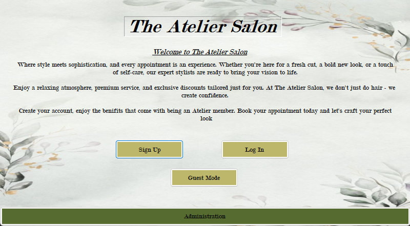
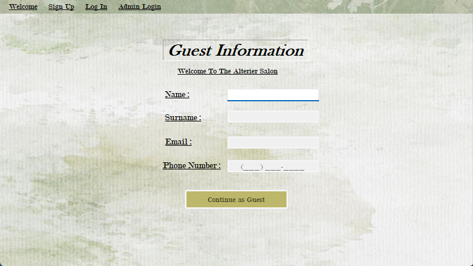
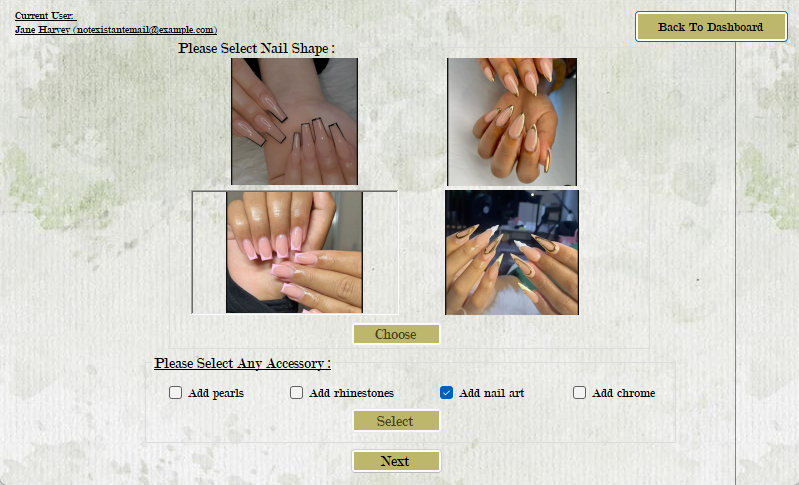
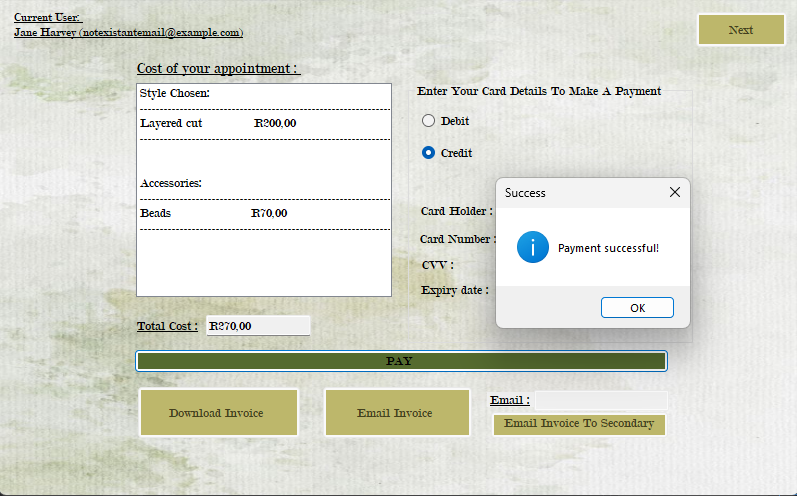
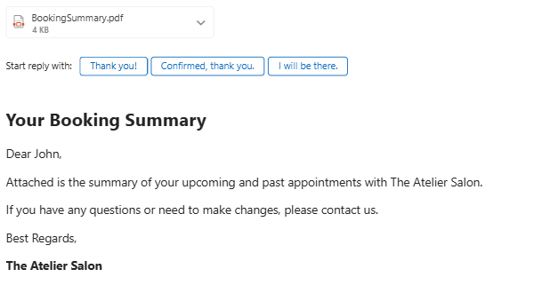
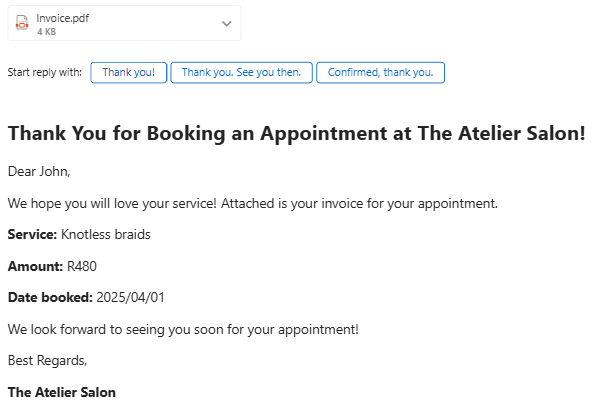
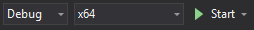

# 💇‍♀️ Salon Appointment Booking System

A desktop-based Salon Appointment System built using C# and Windows Forms. This system allows customers to book appointments, view bookings and generate reports. It also enables salon staff to view bookings and view generate reports.

## 📌 Features

#### ✅ Client Side
- Book new appointments
- Select gender, hair type, and services
- View appointment bookings
- Generate personal appointment summary PDF
- Generate booking invoice PDF
- Receive booking confirmation via email

#### ✅ Admin/Salon Side
- View daily appointment schedule
- Generate financial reports (income, services breakdown, etc.)
- Generate all-appointments summary PDF

#### ✅ Reports
PDF reports generated using PDFsharp including:
- Appointment confirmation
- Client's full appointment history
- Daily appointment list for staff
- Financial summary for date range

#### ✅ Email Integration
##### Client Side
- Send an appointment confirmation email to the client upon successful booking
- Send the customer's booking summary via email

##### Salon Side
- Send daily bookings made by customer's to Salon staff
- Send financial reports to Salon staf

## 📷 Screenshots
|  |  |
|-------------------------------|-------------------------------|
|  |  |

#### Emails
|  |  |
|-------------------------------|-------------------------------|

## ⚙️ Getting Started
#### 🧱 Requirements
- Windows 10/11
- Visual Studio 2019 or later
- [.NET Framework 4.7.2 or later]
- Google email account and app password
- Active internet connection (For sending emails)

#### 🚀 Run the App
1. Clone the repo or download the ZIP
2. [Set up](#create-an-appsettingsjson-file-needed-for-email-handlling-and-acts-as-an-environment-variables-file) appsettings.json
3. Set [platform output](#visual-studio-instructions)
4. Open `SalonAppointmentSystem.sln` in Visual Studio
6. [Sign up or login](#default-admin-login-details)
7. [View instructions](Instructions/Github_version_salon_appointment_system.pdf) and use features 

##### Create an appsettings.json file (needed for email handlling and acts as an environment variables file)
1. Create appsettings.json in the root directory
2. Ensure that within visual studio the file's "Copy To Output Directory" property is set to "Copy if newer"
3. Enter data in the file (copy structure below)
Where Username = your email address
Where Password = your google app password for this program (needs to be created seperately)

        {
          "SmtpConfig": {
            "Server": "smtp.gmail.com",
            "Port": 587,
            "Username": "email@gmail.com",
            "Password": "pass",
            "EnableSSL": true
          },
          "exclude": [
            "**/bin",
            "**/bower_components",
            "**/jspm_packages",
            "**/node_modules",
            "**/obj",
            "**/platforms"
          ]
        }

##### Visual Studio Instructions
Before running the application in Visual Studio, ensure that the output program is in “x64”. Then press the “Start” button. The output is located in the “SalonAppointmentSystem\bin\x64\Debug” folder.

##### Default admin login details
email = your email in appsettings.json
password = a3<$'5/<Ll3u

##### Default customer dummy login details
email = notexistantemail@example.com
password = erA(n.54_v64

## ✍️ Contributors

- Nkosikhona Mlaba
- Andisiwe Cele
- Shriya Deosan
- Owethu Dlamini
- Sanelisiwe Mvula